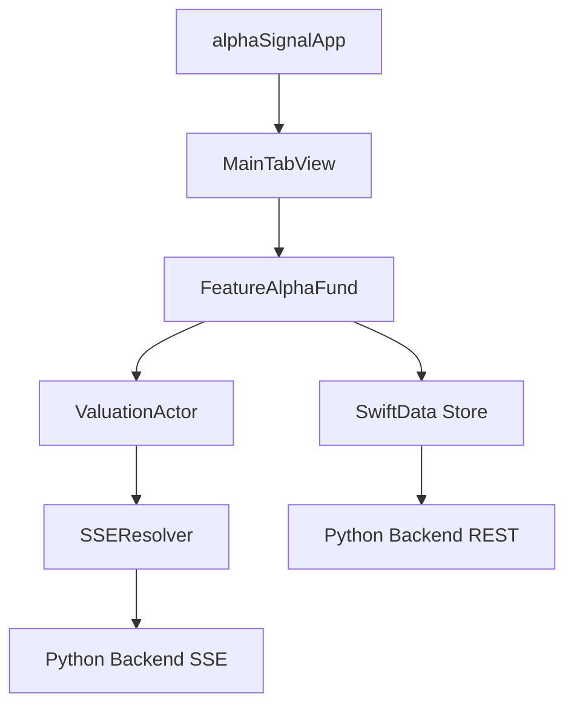

# ALPHA 基金模块技术架构设计文档 (v1.0)

## 1. 架构概览
本模块遵循 **MVVM-I (Model-View-ViewModel-Intent)** 架构，结合 Swift 6 的并发特性（Actors）和分布式数据流思想，确保高频行情下的 UI 流畅度。

---

## 2. 数据流模型 (Data Flow)

### 2.1 实时估算 Actor (ValuationActor)
*   **职责**：负责高频资产价格的计算与状态同步。
*   **特性**：使用 `nonisolated` 接收 SSE 原始数据，在 Actor 内部完成权重累加计算，通过 `AsyncStream` 或 `@Published` (SwiftUI 观察者) 更新 UI。
*   **隔离策略**：所有的数学计算均在 `ValuationActor` 中进行，确保主线程 (MainActor) 仅负责渲染。

### 2.2 存储层 (SwiftData v3)
*   **模型定义**：
    *   `AlphaFund`: 存储基金基础信息、策略类型、2σ 阈值偏好。
    *   `FundPosition`: 存储底层持仓配比（SecurityID, Weight）。
    *   `ValuationHistory`: 每日对账后的官方净值 vs 推算净值记录。
*   **同步策略**：启动时从本地 `SwiftData` 加载缓存，异步从 Backend API 同步最新持仓。

---

## 3. 核心子系统设计

### 3.1 SSE 订阅与解析器 (SSEResolver)
*   **方案**：基于 `URLSession` 的 `bytes(for:)` 异步流。
*   **多路复用**：单个 SSE 连接支持订阅多个资产。当用户进入详情页时，调用 `subscribe(assets: [String])`；离开时调用 `unsubscribe`。

### 3.2 智能预警引擎 (AlarmNotificationManager)
*   **触发器**：监听 `ValuationActor` 的输出。
*   **逻辑**：对比 `current_val` 与 `cached_sigma * 2`。
*   **推送集成**：使用 `UNUserNotificationCenter` 的 `critical` 类型权限。

### 3.3 UI 渲染引擎 (Liquid Glass Engine)
*   **组件化**：
    *   `LiquidTicker`: 使用 `contentTransition(.numericText())` 的实时跳动组件。
    *   `GlassCharts`: 封装自 `Swift Charts`，支持双指缩放 Actor 数据。
    *   `IntelligenceOverlay`: 采用 `matchedGeometryEffect` 实现从列表到情报详情的平滑过渡。

---

## 4. 模块依赖关系 (Dependency Graph)

---

## 5. 性能与功耗优化 (Performance & Power)

*   **Display Link 对齐**：行情更新频率限制在不超过显示刷新率 (Max 120Hz)。
*   **后台挂起 (Background State)**：
    *   当 `scenePhase == .background` 时，断开 SSE 连接以保存电量。
    *   使用 `BackgroundTasks` 框架每小时同步一次静态净值。
*   **内存管理**：使用 `Weak References` 避免 View 与 Actor 之间的循环引用。
